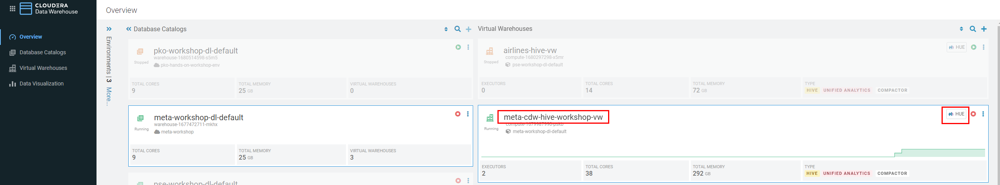
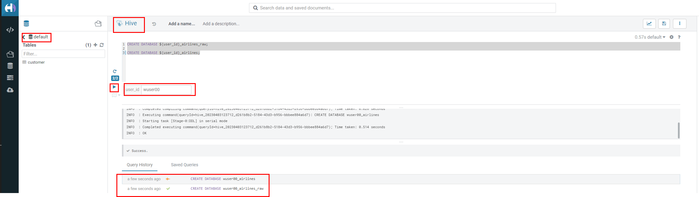

= Cloudera Data Warehouse - Workshop Student Guide

image::images/misc/UC.PNG[]

'''

Version : 1.0.0 `27th March 2023` +

'''
== Pre-requisites

. Laptop with a supported OS (Windows 7 not supported) or MacBook.
. A modern browser - Google Chrome (IE, Firefox, Safari not supported).

== Preface

Working for GE Aircraft Engine, the company wants to increase competitive advantage in two key ways: +
(1) Engineer better, more fault tolerant aircraft engines. +
(2) Be proactive in predictive maintenance on engines, and faster discovery-to-fix in new engine designs. +

This will be a three phase plan: +
*(1) Phase One:*  Understand how our current engines contribute to airline flight delays and fix for future engines. +
*(2) Phase Two:*  Implement an ongoing reporting service to support ongoing engineering efforts to continuously improve engines based on delay data. +
*(3) Phase Three:*  Move to real-time analysis to fix things before they break both in engines already sold, and in new engine designs. +

To do this, we’re going to build a data warehouse & data lakehouse to create reports that engineers can use to improve our engines.  The following people will get to work: +

We will dive into this Scenario to show Cloudera Data Warehouse (CDW) is used to enable GE Aircraft to gain competitive advantage - and at the same time it highlights the performance and automation capabilities that help ensure performance is maintained while controlling costs. +

The Hands On Labs will take you through how to use the Cloudera Data Warehouse service to quickly explore raw data, create curated versions of the data for simple reporting and dashboarding, and then scale up usage of the curated data by exposing it to more users. +

*ER - Diagram of the data* +
*(1) Fact Table:*  flights (86M rows) +
*(2) Dimension Table:*  airlines (1.5k rows), airports (3.3k rows) and planes (5k rows) +

image::images/misc/ER1.PNG[]

== High-Level Steps

Below are the high-level steps for what we will be doing in the workshop. +
*[Step 1 & 2]:* General introduction to CDW to get ourselves oriented for the workshop.  +

    (a) As an Admin: Create and enable the BI analyst team with a Virtual Warehouse.
    (b) As a BI Analyst:  Get familiar with CDW on CDP, and set up our first VW to start working.
    (c) As a BI Analyst:  Wrangle our first set of data - sent to us as a series of .csv files exported from “somewhere else”.
    (d) As an Admin: Monitor the VW and watch as it scales up and down, suspends, etc.
    (e) As a BI Analyst:  Start digging into the data - looking for “needle in a haystack” - running a complex query that will find which engines seem to be correlated to airplane delays for any reason.

*[Step 3]:* Set it up. +

    (a) As an Admin: Create and enable the BI analyst team with a Virtual Warehouse.
    (b) As a BI Analyst:  Get familiar with CDW on CDP, and set up our first VW to start working.
    (c) As a BI Analyst:  Wrangle our first set of data - sent to us as a series of .csv files exported from “somewhere else”.
    (d) As an Admin: Monitor the VW and watch as it scales up and down, suspends, etc.
    (e) As a BI Analyst:  Start digging into the data - looking for “needle in a haystack” - running a complex query that will find which engines seem to be correlated to airplane delays for any reason.

*[Step 4]:* Making it better. +

    (a) As a BI Analyst: Start curating data and building a data lakehouse to improve quality by tweaking data, performance by optimizing schema structures, and ensure reliability and trustworthyness of the data through snapshots, time travel, and rollback.
    (b) Create Hive ACID tables and tweak data for consistency (ex: airline name changes - ensure reporting is consistent with the new name to avoid end user confusion, a new airline joins our customer list, make sure they’re tracked for future data collection, etc..).
    (c) Migrate Tables to Iceberg (We want snapshot and rollback).
    (d) Create new Iceberg tables (we want partitioning).

*[Step 5]:* Optimizing for production. +

    (a) Loading more data - change partitioning to maintain performance  (NOTE:  Ongoing ELT = CDE?).
    (b) Bad data is loaded - use time travel to detect, and rollback to resolve.
    (c) Introduce materialized views to support scaling to 1000’s of simultaneous users.
    (d) As an admin:  Monitor, report, kill queries that run amock, etc.
    
*[Step 6]:* Security & Governance. +

    (a) Check on the lineage to enable governance/audit.
    (b) Row level security to make sure only relevant party can see data.

== Introduction

. Laptop with a supported OS (Windows 7 not supported) or MacBook.
. A modern browser - Google Chrome (IE, Firefox, Safari not supported).
. Wi-Fi Internet connection.

== Step 1: XXXXX

=== Step 1(a): You'll need the following

=== Step 1(b): Setting Workload Password

You will need to define your workload password that will be used to acess non-SSO interfaces. You may read more about it here (https://docs.cloudera.com/management-console/cloud/user-management/topics/mc-access-paths-to-cdp.html).
Please keep it with you. If you have forgotten it, you will be able to repeat this process and define another one.

. Click on your `user name (Ex: wuser00@workshop.com`) at the lower left corner.
. Click on the `Profile` option.

image:images/step1b/1.PNG[]  +

. Click option `Set Workload Password`.
. Enter a suitable `Password` and `Confirm Password`.
. Click button `Set Workload Password`.

image:images/step1b/2.PNG[]  +

image::images/step1b/3.PNG[]

{blank} +

Check that you got the message - `Workload password is currently set` or alternatively, look for a message next to `Workload Password` which says `(Workload password is currently set)`

image::images/step1b/4.PNG[]

== Step 2: Cloudera Data Warehouse - Introduction [NOTHIN TO BE DONE HERE, BUT TO READ/OBSERVE]
In this step you'll explore how to take advantage of CDW.

== Step 3: Cloudera Data Warehouse - Raw Layer (Direct Cloud Object Storage Access)

The objective of this step is to create External tables on top of raw CSV files sitting in cloud storage (In this case it has been stored in AWS S3 by the instructor) and then run few queries to access the data via SQL using HUE. +

=== 3.1 Open Hue for CDW Virtual Warehouse - `meta-cdw-hive-workshop-vw` +

- Click on the 'Hue' button on the right upper corner of `` as shown in the screenshot below. +
  +

- Create new databases.
Enter the following query and then make sure that you enter the user assigned to you. In the screenshot the user is `wuser00`.
[,sql]
----

CREATE DATABASE ${user_id}_airlines_raw;

CREATE DATABASE ${user_id}_airlines;
----

  +

Note that 2 databases are created.

=== 3.2 Run the following DDL in HUE for the CDW Virtual Warehouse - 

=== Notes

*Note*: Higlight
[,sql]
----

CREATE TABLE IF NOT EXISTS <user>_stocks.stock_intraday_1min (
  interv STRING,
  output_size STRING,
  time_zone STRING,
  open DECIMAL(8,4),
  high DECIMAL(8,4),
  low DECIMAL(8,4),
  close DECIMAL(8,4),
  volume BIGINT)
PARTITIONED BY (
  ticker STRING,
  last_refreshed string,
  refreshed_at string)
STORED AS iceberg;
----

____
(user)_stock_dataflow +
____

Let parameters be the default ones. Click `Next`.

* level 1
** level 2
*** level 3
**** level 4
***** level 5
* level 1

Operating Systems::
  Linux:::
    . Fedora
      * Desktop
    . Ubuntu
      * Desktop
      * Server
  BSD:::
    . FreeBSD
    . NetBSD

Cloud Providers::
  PaaS:::
    . OpenShift
    . CloudBees
  IaaS:::
    . Amazon EC2
    . Rackspace