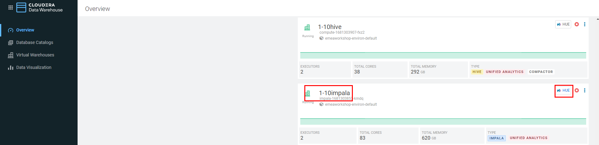
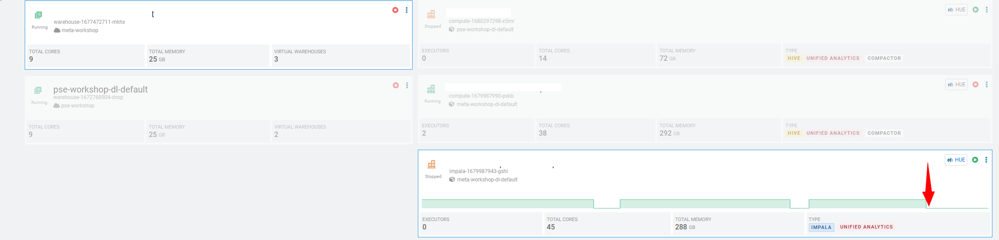
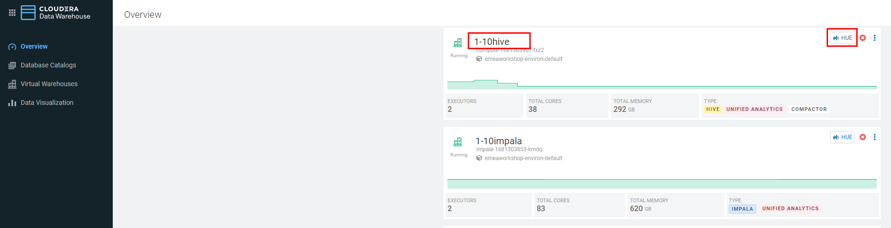
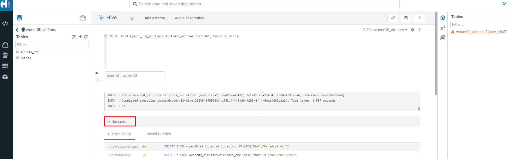

= Cloudera Data Warehouse - Workshop Student Guide

image::images/misc/UC.PNG[]

'''

Version : 1.0.0 `27th March 2023` +

'''
== Pre-requisites

. Laptop with a supported OS (Windows 7 not supported) or MacBook.
. A modern browser - Google Chrome (IE, Firefox, Safari not supported).

== Preface

Working for GE Aircraft Engine, the company wants to increase competitive advantage in two key ways: +
(1) Engineer better, more fault tolerant aircraft engines. +
(2) Be proactive in predictive maintenance on engines, and faster discovery-to-fix in new engine designs. +

This will be a three phase plan: +
*(1) Phase One:*  Understand how our current engines contribute to airline flight delays and fix for future engines. +
*(2) Phase Two:*  Implement an ongoing reporting service to support ongoing engineering efforts to continuously improve engines based on delay data. +
*(3) Phase Three:*  Move to real-time analysis to fix things before they break both in engines already sold, and in new engine designs. +

To do this, we’re going to build a data warehouse & data lakehouse to create reports that engineers can use to improve our engines.  The following people will get to work: +

We will dive into this Scenario to show Cloudera Data Warehouse (CDW) is used to enable GE Aircraft to gain competitive advantage - and at the same time it highlights the performance and automation capabilities that help ensure performance is maintained while controlling costs. +

The Hands On Labs will take you through how to use the Cloudera Data Warehouse service to quickly explore raw data, create curated versions of the data for simple reporting and dashboarding, and then scale up usage of the curated data by exposing it to more users. +

*ER - Diagram of the data* +
*(1) Fact Table:*  flights (86M rows) +
*(2) Dimension Table:*  airlines (1.5k rows), airports (3.3k rows) and planes (5k rows) +

image::images/misc/ER1.PNG[]

== High-Level Steps

Below are the high-level steps for what we will be doing in the workshop. +
*[Step 1 & 2]:* General introduction to CDW to get ourselves oriented for the workshop.  +

    (a) As an Admin: Create and enable the BI analyst team with a Virtual Warehouse.
    (b) As a BI Analyst:  Get familiar with CDW on CDP, and set up our first VW to start working.
    (c) As a BI Analyst:  Wrangle our first set of data - sent to us as a series of .csv files exported from “somewhere else”.
    (d) As an Admin: Monitor the VW and watch as it scales up and down, suspends, etc.
    (e) As a BI Analyst:  Start digging into the data - looking for “needle in a haystack” - running a complex query that will find which engines seem to be correlated to airplane delays for any reason.

*[Step 3]:* Set it up. +

    (a) As an Admin: Create and enable the BI analyst team with a Virtual Warehouse.
    (b) As a BI Analyst:  Get familiar with CDW on CDP, and set up our first VW to start working.
    (c) As a BI Analyst:  Wrangle our first set of data - sent to us as a series of .csv files exported from “somewhere else”.
    (d) As an Admin: Monitor the VW and watch as it scales up and down, suspends, etc.
    (e) As a BI Analyst:  Start digging into the data - looking for “needle in a haystack” - running a complex query that will find which engines seem to be correlated to airplane delays for any reason.

*[Step 4]:* Making it better. +

    (a) As a BI Analyst: Start curating data and building a data lakehouse to improve quality by tweaking data, performance by optimizing schema structures, and ensure reliability and trustworthyness of the data through snapshots, time travel, and rollback.
    (b) Create Hive ACID tables and tweak data for consistency (ex: airline name changes - ensure reporting is consistent with the new name to avoid end user confusion, a new airline joins our customer list, make sure they’re tracked for future data collection, etc..).
    (c) Migrate Tables to Iceberg (We want snapshot and rollback).
    (d) Create new Iceberg tables (we want partitioning).

*[Step 5]:* Optimizing for production. +

    (a) Loading more data - change partitioning to maintain performance  (NOTE:  Ongoing ELT = CDE?).
    (b) Bad data is loaded - use time travel to detect, and rollback to resolve.
    (c) Introduce materialized views to support scaling to 1000’s of simultaneous users.
    (d) As an admin:  Monitor, report, kill queries that run amock, etc.
    
*[Step 6]:* Security & Governance. +

    (a) Check on the lineage to enable governance/audit.
    (b) Row level security to make sure only relevant party can see data.

== Introduction

. Laptop with a supported OS (Windows 7 not supported) or MacBook.
. A modern browser - Google Chrome (IE, Firefox, Safari not supported).
. Wi-Fi Internet connection.

== Step 1: XXXXX

=== Step 1(a): You'll need the following

=== Step 1(b): Setting Workload Password

You will need to define your workload password that will be used to acess non-SSO interfaces. You may read more about it here (https://docs.cloudera.com/management-console/cloud/user-management/topics/mc-access-paths-to-cdp.html).
Please keep it with you. If you have forgotten it, you will be able to repeat this process and define another one.

. Click on your `user name (Ex: wuser00@workshop.com`) at the lower left corner.
. Click on the `Profile` option.

 +

. Click option `Set Workload Password`.
. Enter a suitable `Password` and `Confirm Password`.
. Click button `Set Workload Password`.

image:images/step1b/2.PNG[] +

image::images/step1b/3.PNG[] +

{blank} +

Check that you got the message - `Workload password is currently set` or alternatively, look for a message next to `Workload Password` which says `(Workload password is currently set)`

image::images/step1b/4.PNG[] +

== Step 2: Cloudera Data Warehouse - Introduction [NOTHIN TO BE DONE HERE, BUT TO READ/OBSERVE]
In this step you'll explore how to take advantage of CDW.

== Step 3: Cloudera Data Warehouse - Raw Layer (Direct Cloud Object Storage Access)

The objective of this step is to create External tables on top of raw CSV files sitting in cloud storage (In this case it has been stored in AWS S3 by the instructor) and then run few queries to access the data via SQL using HUE. +

=== 3.1 Open Hue for CDW Virtual Warehouse - `meta-cdw-hive-workshop-vw` +

- Click on the 'Hue' button on the right upper corner of `` as shown in the screenshot below. +
image:images/step3/31-1.png[] +

- Create new databases.
Enter the following query and then make sure that you enter the user assigned to you. In the screenshot the user is `wuser00`.

[,sql]
----

CREATE DATABASE ${user_id}_airlines_raw;

CREATE DATABASE ${user_id}_airlines;
----

  +

- There may be many databases, look for the 2 that start with your <user_id>. Run the following to see that 2 databases that you created.

[source, sql]
----

SHOW DATABASES;
----

image:images/step3/31-3.png[] + 

=== 3.2 Run the following DDL in HUE for the CDW Virtual Warehouse - `meta-cdw-hive-workshop-vw` +
This will create External Tables on CSV Data Files that have been uploaded previously by your instructor in AWS S3. This provides a fast way to allow SQL layer on top of data in cloud storage.

- Copy paste the following into HUE.

[,sql]
----

drop table if exists ${user_id}_airlines_raw.flights_csv;
CREATE EXTERNAL TABLE ${user_id}_airlines_raw.flights_csv(month int, dayofmonth int, dayofweek int, deptime int, crsdeptime int, arrtime int, crsarrtime int, uniquecarrier string, flightnum int, tailnum string, actualelapsedtime int, crselapsedtime int, airtime int, arrdelay int, depdelay int, origin string, dest string, distance int, taxiin int, taxiout int, cancelled int, cancellationcode string, diverted string, carrierdelay int, weatherdelay int, nasdelay int, securitydelay int, lateaircraftdelay int, year int) 
ROW FORMAT DELIMITED FIELDS TERMINATED BY ',' LINES TERMINATED BY '\n' 
STORED AS TEXTFILE LOCATION 's3a://meta-workshop/my-data/meta-cdw-workshop/airlines-raw/airlines-csv/flights' tblproperties("skip.header.line.count"="1");

drop table if exists ${user_id}_airlines_raw.planes_csv;
CREATE EXTERNAL TABLE ${user_id}_airlines_raw.planes_csv(tailnum string, owner_type string, manufacturer string, issue_date string, model string, status string, aircraft_type string, engine_type string, year int) 
ROW FORMAT DELIMITED FIELDS TERMINATED BY ',' LINES TERMINATED BY '\n' 
STORED AS TEXTFILE LOCATION 's3a://meta-workshop/my-data/meta-cdw-workshop/airlines-raw/airlines-csv/planes' tblproperties("skip.header.line.count"="1");

drop table if exists ${user_id}_airlines_raw.airlines_csv;
CREATE EXTERNAL TABLE ${user_id}_airlines_raw.airlines_csv(code string, description string) ROW FORMAT DELIMITED FIELDS TERMINATED BY ',' LINES TERMINATED BY '\n' 
STORED AS TEXTFILE LOCATION 's3a://meta-workshop/my-data/meta-cdw-workshop/airlines-raw/airlines-csv/airlines' tblproperties("skip.header.line.count"="1");

drop table if exists ${user_id}_airlines_raw.airports_csv;
CREATE EXTERNAL TABLE ${user_id}_airlines_raw.airports_csv(iata string, airport string, city string, state DOUBLE, country string, lat DOUBLE, lon DOUBLE) 
ROW FORMAT DELIMITED FIELDS TERMINATED BY ',' LINES TERMINATED BY '\n' 
STORED AS TEXTFILE LOCATION 's3a://meta-workshop/my-data/meta-cdw-workshop/airlines-raw/airlines-csv/airports' tblproperties("skip.header.line.count"="1");
----

Notice the following screenshot corresponding to the above SQL.
 + 

- Check all the tables were created.

[source, sql]
----

USE ${user_id}_airlines_raw;

SHOW TABLES;
----

Make sure that 4 tables (`airlines_csv`, `airports_csv`, `flights_csv`, `planes_csv`) are created as shown below. 

image:images/step3/32-2.png[] 

=== 3.3 Run the following DDL in HUE for the CDW Virtual Warehouse - `meta-cdw-impala-workshop-vw`. +

- Go to the page where now you will access HUE of an Impala virtual warehouse. Click on `HUE` for `meta-cdw-impala-workshop-vw` as shown in the screenshot below.
 +

- Make sure that you click to get `Impala` instead of `default` in the HUE browser as shown below and then click refresh button . +
Now, copy paste the following in the HUE browser and click on Run as shown below.

[source, sql]
----

select count(*) from ${user_id}_airlines_raw.flights_csv;
----

 + 

Notice that while the query is executing, continue to the next step.  Once the query returns you will see the following in the Results - the flights_csv table has over 86 million records.
 +

- Go back to the CDP Console and observe the Impala Virtual Warehouse `meta-cdw-impala-workshop-vw`. +
 +

Here, you'll notice that the warehouse is now at a state where it is not executing any queries and hence, the node count would be low and as the users will run their queries it will scale up or down depending upon the need of resources or lack of it when queries are not run.

- Run the following query to start analyzing the data - “Find the needle in the haystack” query.

[source, sql]
----

SELECT model,
       engine_type
FROM ${user_id}_airlines_raw.planes_csv
WHERE planes_csv.tailnum IN
    (SELECT tailnum
     FROM
       (SELECT tailnum,
               count(*),
               avg(depdelay) AS avg_delay,
               max(depdelay),
               avg(taxiout),
               avg(cancelled),
               avg(weatherdelay),
               max(weatherdelay),
               avg(nasdelay),
               max(nasdelay),
               avg(securitydelay),
               max(securitydelay),
               avg(lateaircraftdelay),
               max(lateaircraftdelay),
               avg(airtime),
               avg(actualelapsedtime),
               avg(distance)
        FROM ${user_id}_airlines_raw.flights_csv
        WHERE tailnum IN ('N194JB',
                          'N906S',
                          'N575ML',
                          'N852NW',
                          'N000AA')
        GROUP BY tailnum) AS delays);

----

image:images/step3/33-5.png[] +

- Go back to the CDP console to observe the behaviour of scaling up/down of virtual warehouse. +
image:images/step3/33-6.png[] +

- Check in the Hue browser and the query show up the result as following. Observe the amount of time taken to run this query. +
 + 

== Step 4: Data Lakehouse - Hive & Iceberg Table Format +
In this step we will take steps to make use of Hive and Iceberg Table formats to provide us with best of both world scenarios in our Data Lakehouse. We will - +
4.1 Create a curated layer from RAW CSV Tables (Created in Step 3). Curated layer will be created in <user_id>_airlines - This will be our 'Data Lakehouse'. Data Lakehouse will be combination of 2 Table Formats (Hive & Iceberg). +
4.2 Migrate over time from Hive to Iceberg Table format and hence have the choice to not have to migrate everything at once.
    4.2.1 Utilize the table Migration feature
    4.2.2 Use Create Table as Select (CTAS)

=== 4.1 Curated layer creation +
- Make sure that you are using the HUE of `meta-cdw-hive-workshop-vw`. Else, click on HUE and go to the HUE browser. +
 + 

- Create `planes` table in `Hive` table format and stored in `parquet` file format.

[source, sql]
----

drop table if exists ${user_id}_airlines.planes;

CREATE EXTERNAL TABLE ${user_id}_airlines.planes (
  tailnum STRING, owner_type STRING, manufacturer STRING, issue_date STRING,
  model STRING, status STRING, aircraft_type STRING,  engine_type STRING, year INT 
) 
STORED AS PARQUET 
TBLPROPERTIES ('external.table.purge'='true');

----
image:images/step4/41-2.png[] + 

- Load `planes` table with data from the Raw layer table `planes_csv`.

[source, sql]
----

INSERT INTO ${user_id}_airlines.planes
  SELECT * FROM ${user_id}_airlines_raw.planes_csv;

----

image:images/step4/41-3.png[] + 

- Switch to '<user_id>_airlines' database by clicking the `<` option to the left of `default` database. Click on `<user_id>_airlines` database. You should see the `planes` table. +

image:images/step4/41-4.png[] + 

 +

 +

- Run the SQL to see if the `planes` table was loaded correctly. Since, `parquet` uses highly efficient column-wise compression which occupies much disk space than CSV file and hence makes it faster to scan data in the `parquet` file. +

[source, sql]
----

SELECT * FROM ${user_id}_airlines.planes LIMIT 100;

----

Scroll down to see more values for the data.

image:images/step4/41-7.png[] +

Scroll down to see more values. 
image:images/step4/41-8.png[] +

- Execute the following command. +

[source, sql]
----

DESCRIBE FORMATTED ${user_id}_airlines.planes;

----
image:images/step4/41-9.png[] + 

In the output look for the following. +
(a) Location: `s3a://meta-workshop/my-data/warehouse/tablespace/external/hive/wuser00_airlines.db/planes` +
(b) Table Type: `EXTERNAL_TABLE` +
(c) SerDe Library: `org.apache.hadoop.hive.ql.io.parquet.serde.ParquetHiveSerDe` +

image:images/step4/41-10.png[] + 

- Create `airlines` table in `Hive` table format and `orc` file format. This table should also be fully `ACID` capable. We will use `Create Table As Select (CTAS)`. Since, `airlines` table can change we need the ability to `Insert/Update/Delete` records. +

[source, sql]
----

drop table if exists ${user_id}_airlines.airlines_orc;
CREATE TABLE ${user_id}_airlines.airlines_orc
STORED AS ORC
AS
  SELECT * FROM ${user_id}_airlines_raw.airlines_csv;

----

image:images/step4/41-11.png[] + 

- Run the following query to check data in the `airlines_orc` table and it should return only 1 row for code 'UA'. +

[source, sql]
----

SELECT * FROM ${user_id}_airlines.airlines_orc WHERE code IN ("UA","XX","PAW");

----
image:images/step4/41-12.png[] + 

- We shall now add a new record to the `airlines_orc` table to see some Hive ACID capabilities. +

[source, sql]
----

INSERT INTO ${user_id}_airlines.airlines_orc VALUES("PAW","Paradise Air");

----
 + 

- Let's update an existing record to change the descritpion of 'United Airlines' to 'Adrenaline Airlines' to see more of the ACID capabalities provided by Hive ACID. Run the following SQL. +

[source, sql]
----

drop table if exists ${user_id}_airlines.airlines_dim_updates;
CREATE EXTERNAL TABLE ${user_id}_airlines.airlines_dim_updates(code string, description string) tblproperties("external.table.purge"="true");

INSERT INTO ${user_id}_airlines.airlines_dim_updates VALUES("UA","Adrenaline Airlines");
INSERT INTO ${user_id}_airlines.airlines_dim_updates VALUES("XX","Get Out of My Airway!");

-- Merge inserted records into Airlines_orc table
MERGE INTO ${user_id}_airlines.airlines_orc USING (SELECT * FROM ${user_id}_airlines.airlines_dim_updates) AS s
  ON s.code = airlines_orc.code
  WHEN MATCHED THEN UPDATE SET description = s.description
  WHEN NOT MATCHED THEN INSERT VALUES (s.code,s.description);

SELECT * FROM ${user_id}_airlines.airlines_orc WHERE code IN ("UA","XX","PAW");

----

The final “SELECT” statement should return the following result - codes “XX” and “PAW” were inserted rows, and code “UA” which had its description value changed from “United Air Lines Inc.” to “Adrenaline Airlines”.
 + 

=== 4.2 Migrate Hive to Iceberg Table +
If you already have created a Data Warehouse using the Hive Table Format, but would like to take advantage of the features offered in the Iceberg Table Format, you have 2 options. We will see both the options as a part of this step. +

==== 4.2.1 (Option 1): Utilize the table Migration feature +

==== 4.2.2 (Option 2): Use Create Table as Select (CTAS) +