= Cloudera Data Warehouse - Workshop Student Guide

 +

'''

Version : 2.0 `20th March 2025` +

'''

== Pre-requisites

. Laptop with a supported OS (Windows 7 not supported) or MacBook. Please disable any VPNs. +
. A modern browser - Google Chrome (The workshop hasn't been tested on IE, Firefox, Safari or any other browser. Please stick to Chrome to avoid any unseen issues). +
. Wi-Fi Internet connection with minimal security firewall on laptop and network. +

== Access Details

Your instructor will guide you through the following. +
1. https://tinyurl.com/2awfrsxa[HOL Credentials] - Participants must enter their `First Name`, `Last Name` & `Company` details and make a note of corresponding `Workshop Login Username`, `Workshop Login Password` and `CDP Workload User` to be used in this workshop. +
2. http://18.194.72.243/realms/master/protocol/saml/clients/cdp-sso[Workshop login] - Using the details in the previous step make sure you are able to login here. +

== Business Case

Working for an Aircraft Engine company, the company wants to increase competitive advantage in two keyways: +
(1) Engineer better, more fault tolerant aircraft engines. +
(2) Be proactive in predictive maintenance on engines, and faster discovery-to-fix in new engine designs. +

This will be a three-phase plan: +
*(1) Phase One:*  Understand how our current engines contribute to airline flight delays and fix for future engines. +
*(2) Phase Two:*  Implement an ongoing reporting service to support ongoing engineering efforts to continuously improve engines based on delay data. +
*(3) Phase Three:*  Move to real-time analysis to fix things before they break both in engines already sold, and in new engine designs. +

To do this, we’re going to build a data warehouse & data lakehouse to create reports that engineers can use to improve our engines. +

We will dive into this scenario to show Cloudera Data Warehouse (CDW) is used to enable the Aircraft company to gain competitive advantage - and at the same time it highlights the performance and automation capabilities that help ensure performance is maintained while controlling costs. +

> From a technical stand point you will discover the integration of Apache Iceberg to support all Open Data Lakehouse initiatives of Cloudera to benefit from better performance, reducedmaintenance, multifunctional analysis without having numerous data copies, and greater control over data. You will be exploring the Data Catalog lineage and also work on row level security. Towards the end you will be creating data model and visualization to derive insights. In this technical session, you will be guided step-by-step through a number of practical exercises, grouped into Labs. The workshop is based on a dataset of flights in the United States. +

*Entity Relationship Diagram (ERD)* + 

image:images/icons/er.png[] +

*Underlying Tables details* +

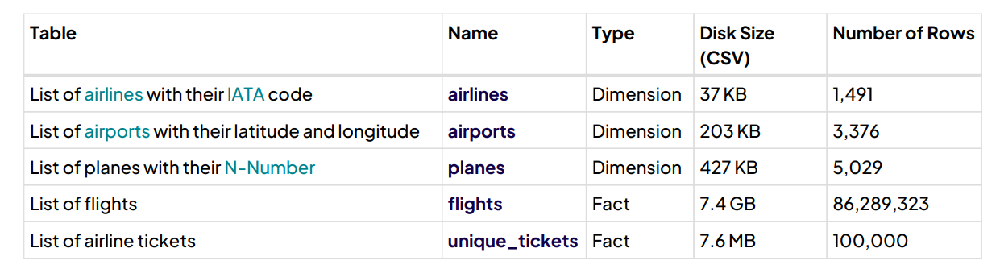 + 

*CSV files uploaded in S3 bucket* +

 +

== Step 1: Getting Started

WARNING: Please make sure that you are working on the browser (Chrome)  in *INCOGNITO MODE*  only for the entirety of the workshop. +

=== Step 1(a): You'll need the following

Please note the following: +

(a) `Workshop Login Username`: \____________________ _(Your Instructor would provide this)_ +
(b) `Workshop Login Password`: \____________________ _(Your Instructor would provide this)_ +
(c) `CDP Workload User` (`${user_id}` or `<user_id>`): \____________________ _(Your Instructor would provide this)_ +
(d) `CDP Workload Password`: \_____________________ _(`You will` set it in `Step 1(b)` of the workshop)_ +
(e) `Hive Virtual Warehouse Name`: \____________________ _(Your Instructor would provide this)_ +
(f) `Impala Virtual Warehouse Name`: \____________________ _(Your Instructor would provide this)_ +

In the labs when you see: +
`${user_id}` or `<user_id>` - this will indicate to use your User (`CDP Workload User`) as item *(c)* above. +

=== Step 1(b): Define CDP Workload Password

*`Suggestion:`* `Ideal way to work through this workshop will be to have 2 browsers opened. One to be used in a way that you can follow instructions using GitHub and the other one to be used for the workshop related screens.` +

Please use the login URL: http://18.194.72.243/realms/master/protocol/saml/clients/cdp-sso[Workshop login]. +
If you have opened in Incognito mode then you might see the following screen. Just click on `Continue to site` and proceed. +
 +

Enter the `Workshop Login Username` and `Workshop Login Password` shared by your instructor. +

(*Note*: Note that your username would be something like `emerging01`.) +
 +

If asked update the password with your own password.
 +

You should be able to get the following home page of CDP Public Cloud.
 +

You will need to define your `CDP Workload Password` that will be used to access non-SSO interfaces. You may read more about it https://docs.cloudera.com/management-console/cloud/user-management/topics/mc-access-paths-to-cdp.html[here].
Please keep it with you. If you have forgotten it, you will be able to repeat this process and define another one.

. Click on your `user name (Ex: User-emerging01 emerging01`) at the upper right top corner.
. Click on the `Profile` option.

 +

. Click option `Set Workload Password`.
. Enter a suitable `Password` and `Confirm Password`.
. Click the button `Set Workload Password`.

 +

 +

{blank} +

Check that you got the message - `Workload password is currently set` or alternatively, look for a message next to `Workload Password` which says `(Workload password is currently set)`

 +

== Step 2: (Optional) Cloudera Data Warehouse - Introduction +
In this step you'll explore how to take advantage of CDW.

=== Step 2(a): Navigating Cloudera Data Warehouse (CDW) +

WARNING: INSTRUCTOR WILL WALK YOU THROUGH THE ENVIRONMENT. +

=== Step 2(b): Useful Information for Self Reads/Tours
Click the below for *`Virtual Tour`* Experience(s): +
(a) https://www.cloudera.com/users/cdp-tour-cdw-intro.html[CDW Virtual Tour] +
(b) https://www.cloudera.com/users.html#tours[Virtual Tour of CDP & Other Data Services] +

Click the below for *`Detailed Documentation(s)`*: +
(a) https://docs.cloudera.com/data-warehouse/cloud/getting-started/topics/dw-getting-started-intro.html[Getting Started in CDW] +
(b) https://docs.cloudera.com/data-warehouse/cloud/index.html[CDP Public Cloud Data Warehouse] +
(c) https://docs.cloudera.com/cdp-private-cloud/latest/index.html[CDP Private Cloud Getting Started]

== Step 3: Cloudera Data Warehouse - Raw Layer (Direct Cloud Object Storage Access)

The objective of this step is to create External tables on top of raw CSV files sitting in cloud storage (In this case it has been stored in AWS S3 by the instructor) and then run few queries to access the data via SQL using HUE. +

To go to Cloudera Data Warehouse, click the following options as shown in the screenshots below. +
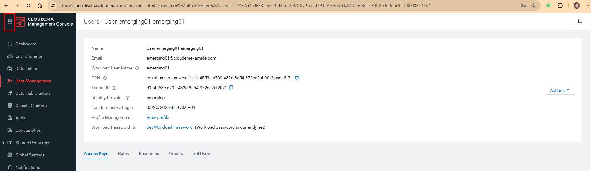 +

 +

If you see the message `! Having trouble connecting to server` just click the cross icon next to it and proceed. +
 +

=== 3.1 Open Hue for CDW Virtual Warehouse - `emerging-hive-1` +

- Click on the image:images/step3/hue.png[] button on the right upper corner of `emerging-hive-1` as shown in the screenshot below. +
image:images/step3/3-4.png[] +

- The following page should open with Hive query editor. +
  +

> *Note*: From here on you will be entering numerous SQL statements. Use the copy option next to the SQL statement by clicking the  icon.

- Create new databases. +
Enter the following query and then make sure that you enter the user assigned to you. Click on Run icon. In the screenshot the query is run using the user `emerging01`.

[,sql]
----

CREATE DATABASE ${user_id}_airlines_raw;

CREATE DATABASE ${user_id}_airlines;
----

image:images/step3/3-6.png[]  +

  +

- There may be many databases, look for the 2 that start with your *`<user_id>`*. Run the following SQL to see the 2 databases that you created just now.

[source, sql]
----

SHOW DATABASES;
----

 + 

=== 3.2 Run the following DDL in HUE for the CDW Virtual Warehouse - `emerging-hive-1` +
This will create External Tables on CSV Data Files that have been uploaded previously by your instructor in AWS S3. This provides a fast way to allow SQL layer on top of data in cloud storage.

- Copy paste the following into HUE. +

[,sql]
----

drop table if exists ${user_id}_airlines_raw.flights_csv;
CREATE EXTERNAL TABLE ${user_id}_airlines_raw.flights_csv(month int, dayofmonth int, dayofweek int, deptime int, crsdeptime int, arrtime int, crsarrtime int, uniquecarrier string, flightnum int, tailnum string, actualelapsedtime int, crselapsedtime int, airtime int, arrdelay int, depdelay int, origin string, dest string, distance int, taxiin int, taxiout int, cancelled int, cancellationcode string, diverted string, carrierdelay int, weatherdelay int, nasdelay int, securitydelay int, lateaircraftdelay int, year int)
ROW FORMAT DELIMITED FIELDS TERMINATED BY ',' LINES TERMINATED BY '\n'
STORED AS TEXTFILE LOCATION 's3a://emerging-buk-6830e020/my-data/meta-cdw-workshop/airlines-raw/airlines-csv/flights' tblproperties("skip.header.line.count"="1");

drop table if exists ${user_id}_airlines_raw.planes_csv;
CREATE EXTERNAL TABLE ${user_id}_airlines_raw.planes_csv(tailnum string, owner_type string, manufacturer string, issue_date string, model string, status string, aircraft_type string, engine_type string, year int)
ROW FORMAT DELIMITED FIELDS TERMINATED BY ',' LINES TERMINATED BY '\n'
STORED AS TEXTFILE LOCATION 's3a://emerging-buk-6830e020/my-data/meta-cdw-workshop/airlines-raw/airlines-csv/planes' tblproperties("skip.header.line.count"="1");

drop table if exists ${user_id}_airlines_raw.airlines_csv;
CREATE EXTERNAL TABLE ${user_id}_airlines_raw.airlines_csv(code string, description string) ROW FORMAT DELIMITED FIELDS TERMINATED BY ',' LINES TERMINATED BY '\n'
STORED AS TEXTFILE LOCATION 's3a://emerging-buk-6830e020/my-data/meta-cdw-workshop/airlines-raw/airlines-csv/airlines' tblproperties("skip.header.line.count"="1");

drop table if exists ${user_id}_airlines_raw.airports_csv;
CREATE EXTERNAL TABLE ${user_id}_airlines_raw.airports_csv(iata string, airport string, city string, state DOUBLE, country string, lat DOUBLE, lon DOUBLE)
ROW FORMAT DELIMITED FIELDS TERMINATED BY ',' LINES TERMINATED BY '\n'
STORED AS TEXTFILE LOCATION 's3a://emerging-buk-6830e020/my-data/meta-cdw-workshop/airlines-raw/airlines-csv/airports' tblproperties("skip.header.line.count"="1");
----

Notice the following screenshot corresponding to the above SQL. +

 + 

- Check all the 4 tables were created.

[source, sql]
----

USE ${user_id}_airlines_raw;

SHOW TABLES;
----

Make sure that 4 tables (`airlines_csv`, `airports_csv`, `flights_csv`, `planes_csv`) are created as shown below. 

 +

 +

=== 3.3 Run the following DDL in HUE for the CDW Virtual Warehouse - `emerging-impala-1`. +

- Go to the page where now you will access HUE of an Impala virtual warehouse. Click on `HUE` for *`emerging-impala-1`* as shown in the screenshot below. +

 +

- Make sure that you click to get `Impala` query editor in the HUE browser as shown below. +

 +

Now, copy paste the following in the HUE browser and click on Run as shown below.

[source, sql]
----

select count(*) from ${user_id}_airlines_raw.flights_csv;
----

 +

Notice that `the flights_csv table has over 86 million records`. +

- Run the following query to start analyzing the data - `Find the needle in the haystack` query. +

[source, sql]
----

SELECT model,
       engine_type
FROM ${user_id}_airlines_raw.planes_csv
WHERE planes_csv.tailnum IN
    (SELECT tailnum
     FROM
       (SELECT tailnum,
               count(*),
               avg(depdelay) AS avg_delay,
               max(depdelay),
               avg(taxiout),
               avg(cancelled),
               avg(weatherdelay),
               max(weatherdelay),
               avg(nasdelay),
               max(nasdelay),
               avg(securitydelay),
               max(securitydelay),
               avg(lateaircraftdelay),
               max(lateaircraftdelay),
               avg(airtime),
               avg(actualelapsedtime),
               avg(distance)
        FROM ${user_id}_airlines_raw.flights_csv
        WHERE tailnum IN ('N194JB',
                          'N906S',
                          'N575ML',
                          'N852NW',
                          'N000AA')
        GROUP BY tailnum) AS delays);

----

 +

== Step 4: Data Lakehouse - Hive & Iceberg Table Format +

 +

In this step we will take steps to make use of Hive and Iceberg Table formats to provide us with best of both world scenarios in our Data Lakehouse. We will - +

*4.1* Create a curated layer from RAW CSV Tables (Created in Step 3). Curated layer will be created in `<user_id>_airlines` - This will be our 'Data Lakehouse'. Data Lakehouse will be a combination of 2 Table Formats (Hive & Iceberg). +
*4.2* Migrate over time from Hive to Iceberg Table format and hence have the choice to not have to migrate everything at once. +
      4.2.1 Utilize the table Migration feature. +
      4.2.2 Use Create Table as Select (CTAS). +

=== 4.1 Curated layer creation +
- Make sure that you are using the HUE of `emerging-hive-1`. Else, click on `HUE` and go to the HUE browser. +

 + 

image:images/step4/4-2.png[] + 

- Create `planes` table in `Hive` table format and stored in `parquet` file format.

[source, sql]
----

drop table if exists ${user_id}_airlines.planes;

CREATE EXTERNAL TABLE ${user_id}_airlines.planes (
  tailnum STRING, owner_type STRING, manufacturer STRING, issue_date STRING,
  model STRING, status STRING, aircraft_type STRING,  engine_type STRING, year INT 
) 
STORED AS PARQUET 
TBLPROPERTIES ('external.table.purge'='true');

----
 +

- Load `planes` table with data from the Raw layer table `planes_csv`.

[source, sql]
----

INSERT INTO ${user_id}_airlines.planes
  SELECT * FROM ${user_id}_airlines_raw.planes_csv;

----

 +

- Run the SQL to see if the `planes` table was loaded correctly. Since, `parquet` uses highly efficient column-wise compression which occupies much disk space than CSV file and hence makes it faster to scan data in the `parquet` file. +

[source, sql]
----

SELECT * FROM ${user_id}_airlines.planes LIMIT 100;

----

Scroll down to see more values for the data. +

 +

Scroll down to see more values. +

 +

- Execute the following command. +

[source, sql]
----

DESCRIBE FORMATTED ${user_id}_airlines.planes;

----

 + 

In the output look for the following. +
//(a) Location: `s3a://emeaworkshop/my-data/warehouse/tablespace/external/hive/emerging01_airlines.db/planes` +
(a) Location: `s3a://.../warehouse/tablespace/external/hive/emerging01_airlines.db/planes` +
(b) Table Type: `EXTERNAL_TABLE` +
(c) SerDe Library: `org.apache.hadoop.hive.ql.io.parquet.serde.ParquetHiveSerDe` +

 + 

- Create `airlines` table in `Hive` table format and `orc` file format. This table should also be fully `ACID` capable. We will use `Create Table As Select (CTAS)`. Since, `airlines` table can change we need the ability to `Insert/Update/Delete` records. +

[source, sql]
----

drop table if exists ${user_id}_airlines.airlines_orc;
CREATE TABLE ${user_id}_airlines.airlines_orc
STORED AS ORC
AS
  SELECT * FROM ${user_id}_airlines_raw.airlines_csv;

----

 +

- Run the following query to check data in the `airlines_orc` table and it should return only 1 row for code 'UA'. +

[source, sql]
----

SELECT * FROM ${user_id}_airlines.airlines_orc WHERE code IN ("UA","XX","PAW");

----

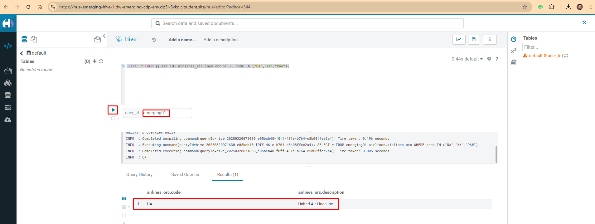 + 

- We shall now add a new record to the `airlines_orc` table to see some Hive ACID capabilities. +

[source, sql]
----

INSERT INTO ${user_id}_airlines.airlines_orc VALUES("PAW","Paradise Air");

----
 + 

- Now, let's create a new table called  `airlines_dim_updates` and insert 2 new records for `United Airlines` with code `UA` and  `Get Out of My Airway!` with code `XX`. +

[source, sql]
----

drop table if exists ${user_id}_airlines.airlines_dim_updates;
CREATE EXTERNAL TABLE ${user_id}_airlines.airlines_dim_updates(code string, description string) tblproperties("external.table.purge"="true");

INSERT INTO ${user_id}_airlines.airlines_dim_updates VALUES("UA","Adrenaline Airlines");
INSERT INTO ${user_id}_airlines.airlines_dim_updates VALUES("XX","Get Out of My Airway!");

----

 +

- At this point the 2 tables contain data for the specific airlines with code `UA, XX & PAW` as follows. +

[source, sql]
----

select * from ${user_id}_airlines.airlines_dim_updates where code in ('UA','PAW','XX');

----

 +

[source, sql]
----

select * from ${user_id}_airlines.airlines_orc where code in ('UA','PAW','XX');

----

 +

- Just another representation of the 2 tables that contain data for the specific airlines with code `UA, XX & PAW`. +

image:images/step4/4-14a.png[] +

- Let's update an existing record to change the description of `United Airlines` to `Adrenaline Airlines` to see more of the `ACID` capabilities provided by Hive ACID. Run the following SQL. +

[source, sql]
----

-- Merge inserted records into Airlines_orc table
MERGE INTO ${user_id}_airlines.airlines_orc USING (SELECT * FROM ${user_id}_airlines.airlines_dim_updates) AS s
  ON s.code = airlines_orc.code
  WHEN MATCHED THEN UPDATE SET description = s.description
  WHEN NOT MATCHED THEN INSERT VALUES (s.code,s.description);

SELECT * FROM ${user_id}_airlines.airlines_orc WHERE code IN ("UA","XX","PAW");

----

 +

The final `SELECT` statement should return the following result - codes `XX` and `PAW` were inserted rows, and code `UA` which had its description value changed from `United Air Lines Inc.` to `Adrenaline Airlines`. +

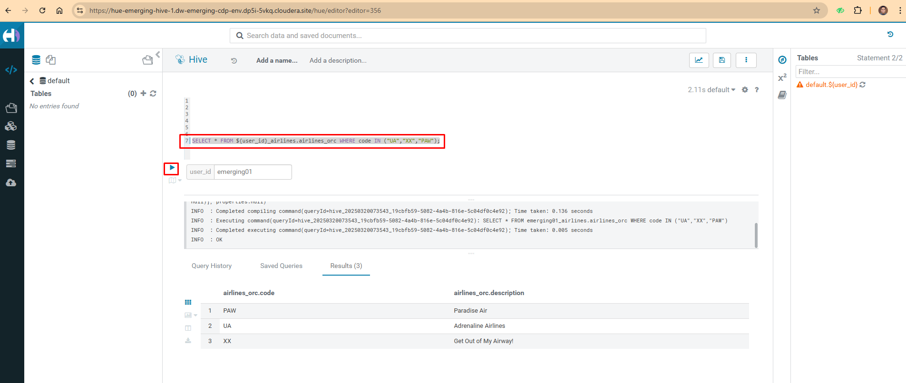 +

=== 4.2 Migrate Hive to Iceberg Table +
If you already have created a Data Warehouse using the Hive Table Format but would like to take advantage of the features offered in the Iceberg Table Format, you have 2 options. We will see both the options as a part of this step. +

Note that the `planes` table that we created earlier has `SerDe Library: org.apache.hadoop.hive.ql.io.parquet.serde.ParquetHiveSerDe`. Note the 'ParquetHiveSerDe' part. You can check the same by running the command below. +

[source, sql]
----

DESCRIBE FORMATTED ${user_id}_airlines.planes;

----

 +

==== 4.2.1 (Option 1): Utilize the table Migration feature +
- Run the following SQL and note what happens next. +

[source, sql]
----

ALTER TABLE ${user_id}_airlines.planes
SET TBLPROPERTIES ('storage_handler'='org.apache.iceberg.mr.hive.HiveIcebergStorageHandler');

DESCRIBE FORMATTED ${user_id}_airlines.planes;

----

 +

The following happened. +
*(a).* This migration to Iceberg happened in-place & there was no re-writing of data that occurred as part of this process.  It retained the File Format of `parquet` for the Iceberg table as well.  There was a Metadata file that was created, which you can see when you run the `DESCRIBE FORMATTED`. +

*(b).* In the output look for the following fields - look for the following (see image with highlighted fields) key values: 
    `Table Type`, `Location` (location of where table data is stored), `SerDe Library`, and in Table Parameters look for properties `MIGRATED_TO_ICEBERG`, `storage_handler`, `metadata_location`, and `table_type`. 

`Location` - Data is stored in cloud storage and in this case AWS S3 in the same location as the Hive Table Format. +
`Table Type`: Indicates that it is an `EXTERNAL TABLE`. +
`MIGRATED_TO_ICEBERG`: Indicates that the table has migrated to `ICEBERG`. +
`table_type`: Indicates `ICEBERG` table format. +
`metadata_location`: Indicates the location of `metadata` which is the path to cloud storage. +
`storage_handler`: `org.apache.iceberg.mr.hive.HiveIcebergStorageHandler`. +
`SerDe Library`: `org.apache.iceberg.mr.hive.HiveIcebergSerDe`. +

image:images/step4/4-19.png[] +

 +

==== 4.2.2 (Option 2): Use Create Table as Select (CTAS) +
- Run the following SQL to create `airports` table using CTAS. Notice the syntax to create an Iceberg Table within Hive is `Stored by Iceberg`. +

[source, sql]
----

drop table if exists ${user_id}_airlines.airports;
CREATE EXTERNAL TABLE ${user_id}_airlines.airports
STORED BY ICEBERG AS
  SELECT * FROM ${user_id}_airlines_raw.airports_csv;

DESCRIBE FORMATTED ${user_id}_airlines.airports;

----

Look for:  `Table Type`, `Location` (location of where table data is stored), `SerDe Library`, and in Table Parameters look for properties `storage_handler`, `metadata_location`, and `table_type`. +

 +

 +

 +

=== 4.3 Create Iceberg Table (Partitioned, Parquet File Format) +
- In this step we will create a partitioned table, in `Iceberg` *Table Format*, stored in `Parquet` *File Format*.  Other than that we could specify other file formats that are supported for Iceberg which are: `ORC and Avro`. +

[source, sql]
----

drop table if exists ${user_id}_airlines.flights;
CREATE EXTERNAL TABLE ${user_id}_airlines.flights (
 month int, dayofmonth int, 
 dayofweek int, deptime int, crsdeptime int, arrtime int, 
 crsarrtime int, uniquecarrier string, flightnum int, tailnum string, 
 actualelapsedtime int, crselapsedtime int, airtime int, arrdelay int, 
 depdelay int, origin string, dest string, distance int, taxiin int, 
 taxiout int, cancelled int, cancellationcode string, diverted string, 
 carrierdelay int, weatherdelay int, nasdelay int, securitydelay int, 
 lateaircraftdelay int
) 
PARTITIONED BY (year int)
STORED BY ICEBERG 
STORED AS PARQUET
tblproperties ('format-version'='2');

SHOW CREATE TABLE ${user_id}_airlines.flights;

----

 +

The `SHOW CREATE TABLE` command is the unformatted version of `DESCRIBE FORMATTED` command. Pay attention to the `PARTITIONED BY SPEC`, where we have partitioned the `flights` table using the `year` column. +

 +

- We will insert data into this table and it will write data together within the same partition (i.e. all 2006 data is written to the same location, all 2005 data is written to the same location, etc.). `This command will take some time to run`. +

[source, sql]
----

INSERT INTO ${user_id}_airlines.flights
SELECT * FROM ${user_id}_airlines_raw.flights_csv
WHERE year <= 2006;

----

 + 

- Run the following SQL and notice that each of the years have a range of data within a few million flights (each record in the flights table counts as a flight). +

[source, sql]
----

SELECT year, count(*) 
FROM ${user_id}_airlines.flights
GROUP BY year
ORDER BY year desc;

----

 +

- Now, make sure that the following *5 tables* are created up until this point as shown in the screenshot below. +

 +

== Recap

Below is the summary of what we have done so far in the form of a screenshot.

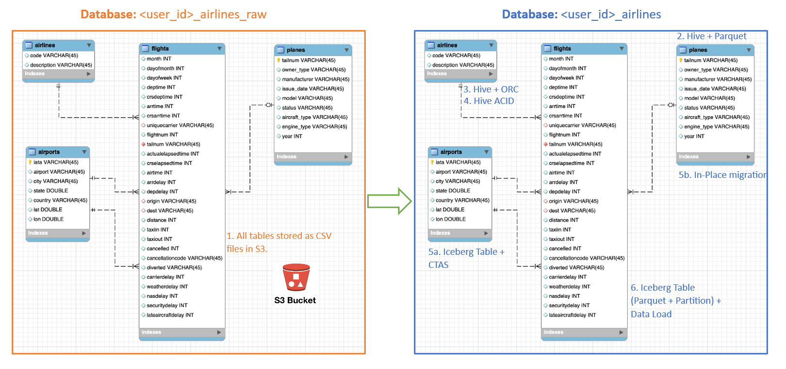 +

*(1).* Created a Raw Layer by defining Tables that point to CSV data files in an S3 bucket. We were then immediately able to query and run analytics against that data. +
*(2).* Created a Curated Layer to be the basis of our Data Lakehouse. +

** *(2.1).* Created the `planes` table in Hive table format stored in `Parquet` to improve performance of querying this from the Raw CSV data due to how the data is stored. Migrated, `in-place` - no data rewrite, the planes table from Hive table format to Iceberg table format using the Migration utility (Alter Table statement). +
** *(2.2).* Created the `airlines_orc` table in Hive table format stored in `ORC` to improve performance of querying this from the Raw CSV data due to how the data is stored. Took advantage of the Hive `ACID` capabilities to Insert, Update, Delete, and Merge data into this table.  Here we created a staging table to write new incoming data to be used to update the `airlines_orc` table with (Merge command). +
** *(2.3).* Created the `airports` table in Iceberg Table Format using a `CTAS` statement querying the Raw CSV data to take advantage of the features of Iceberg. +
** *(2.4).* Created the flights table in Iceberg Table Format and partitioned the table by the year column. Inserted data into the table up to year 2006.
    
As a final step here, let's run the same analytic query we ran against the Raw layer now in our Data Lakehouse DW, to see what happens with performance. 
From the cloudera console click on -  `emerging-impala-1`. +

image:images/step4/4-29.png[] +

- Now run the following query again.

[source, sql]
----

SELECT model,
       engine_type
FROM ${user_id}_airlines.planes
WHERE planes.tailnum IN
    (SELECT tailnum
     FROM
       (SELECT tailnum,
               count(*),
               avg(depdelay) AS avg_delay,
               max(depdelay),
               avg(taxiout),
               avg(cancelled),
               avg(weatherdelay),
               max(weatherdelay),
               avg(nasdelay),
               max(nasdelay),
               avg(securitydelay),
               max(securitydelay),
               avg(lateaircraftdelay),
               max(lateaircraftdelay),
               avg(airtime),
               avg(actualelapsedtime),
               avg(distance)
        FROM ${user_id}_airlines.flights
        WHERE tailnum IN ('N194JB',
                          'N906S',
                          'N575ML',
                          'N852NW',
                          'N000AA')
        GROUP BY tailnum) AS delays);

----

 +

The Data Lakehouse DW query performs significantly better than the same query running against the CSV data. + 

*`Note: Please note that depending upon how the warehouse is configured (Auto suspend being set or unset), the query may take more time as the pods take time to start up`* +

== Step 5: Performance Optimizations & Table maintenance Using Impala VW +
In this Step we will look at some of the performance optimization and table maintenance tasks that can be performed to ensure the best possible TCO, while ensuring the best performance. +

=== 5.1 Iceberg in-place Partition Evolution [Performance Optimization] +
- Open HUE for the CDW `Hive` Virtual Warehouse - `emerging-hive-1` +

image:images/step5/5-1.png[] +

- One of the key features for Iceberg tables is the ability to evolve the partition that is being used *over time*. +

[source, sql]
----

ALTER TABLE ${user_id}_airlines.flights
SET PARTITION spec ( year, month );

SHOW CREATE TABLE ${user_id}_airlines.flights;

----

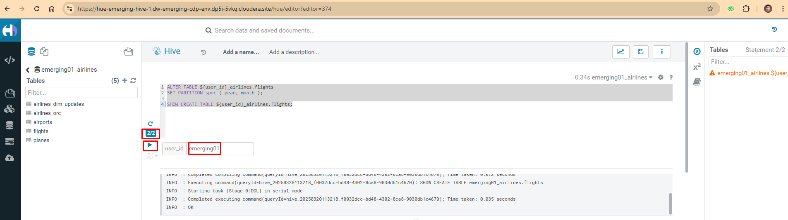 +

- Check for the following where now the partition is by `year, month`. +

 +

- Load new data into the flights table using the *NEW* partition definition. `This query will take a while to run`. +

[source, sql]
----

INSERT INTO ${user_id}_airlines.flights 
SELECT * FROM ${user_id}_airlines_raw.flights_csv 
WHERE year = 2007;

----

 +

- Open HUE for the CDW `Impala` Virtual Warehouse - `emerging-impala-1`. +

 +

- In the Hue editor look make sure `Impala` is selected as the engine else follow the screenshot to change it to impala. +

 +

- Copy/paste the following in the HUE Editor, but *`DO NOT`* execute the query. +

[source, sql]
----

SELECT year, month, count(*) 
FROM ${user_id}_airlines.flights
WHERE year = 2006 AND month = 12
GROUP BY year, month
ORDER BY year desc, month asc;

----

- Run `Explain Plans` against some typical analytic queries we might run to see what happens with this new Partition. +

 +

 +

- Copy/paste the following in the HUE Editor, but *`DO NOT`* execute the query. +

[source, sql]
----

SELECT year, month, count(*) 
FROM ${user_id}_airlines.flights
WHERE year = 2007 AND month = 12
GROUP BY year, month
ORDER BY year desc, month asc;

----

- Run `Explain Plans` against some typical analytic queries we might run to see what happens with this new Partition. +

 +

In the output notice the amount of data that needs to be scanned for this query, about `11 MB`, is significantly less than that of the first, `138 MB`.  This shows an important capability of Iceberg, Partition Pruning.  Meaning that much less data is scanned for this query and only the selected month of data needs to be processed.  This should result in much faster query execution times. +

 + 

=== 5.2 Iceberg Snapshots [Table Maintenance] +
- In the previous steps we have loaded data into the `flights` iceberg table. We will insert more data into it. Each time we add (update or delete) data a `snapshot` is captured. The snapshot is important for `eventual consistency` & to allow multiple read/writes concurrently (from various engines or the same engine). +

[source, sql]
----

INSERT INTO ${user_id}_airlines.flights 
SELECT * FROM ${user_id}_airlines_raw.flights_csv 
WHERE year >= 2008;

----

 +

- To see snapshots, execute the following SQL. +

[source, sql]
----

DESCRIBE HISTORY ${user_id}_airlines.flights;

----

 +

In the output there should be *3 Snapshots*, described below.  Note that we have been reading/writing data from/to the Iceberg table from both Hive & Impala. It is an important aspect of Iceberg Tables that they support *`multi-function analytics`* - ie. many engines can work with Iceberg tables (`Cloudera Data Warehouse [Hive & Impala]`, `Cloudera Data Engineering [Spark]`, `Cloudera Machine Learning [Spark]`, `Cloudera DataFlow [NiFi]`, and `DataHub Clusters`).

- Get the details of the `snapshots` and store it in a notepad. +

 +

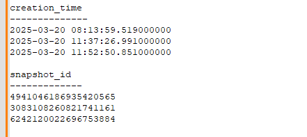 +

=== 5.3 Iceberg Time Travel [Table Maintenance] +
- Copy/paste the following data into the Impala Editor, but *`DO NOT`* execute.  

[source, sql]
----

-- SELECT DATA USING TIMESTAMP FOR SNAPSHOT
SELECT year, count(*) 
FROM ${user_id}_airlines.flights
  FOR SYSTEM_TIME AS OF '${create_ts}'
GROUP BY year
ORDER BY year desc;

-- SELECT DATA USING SNAPSHOT ID FOR SNAPSHOT
SELECT year, count(*) 
FROM ${user_id}_airlines.flights
  FOR SYSTEM_VERSION AS OF ${snapshot_id}
GROUP BY year
ORDER BY year desc;

----
 +

- After copying you will see 2 parameters as below. +

 +

- From the notepad just copy the first value of the timestamp. It could be the date or the timestamp. Paste it in the `create_ts` box. In our case the value was `2025-03-20 08:13:59.519000000`. Then execute the highlighted query only (*1st query*). +

 +

- From the notepad just copy the second value of the snapshot id. In our case the value was `3083108260821741161`. Paste it in the `snapshot_id` box. Then execute the highlighted query only (*2nd query*). +

 +

=== 5.4 (Don't Run, FYI ONLY) - Iceberg Rollback [Table Maintenance]  +
- Sometimes data can be loaded incorrectly, due to many common issues - missing fields, only part of the data was loaded, bad data, etc.  In situations like this data would need to be removed, corrected, and reloaded.  Iceberg can help with the Rollback command to remove the “unwanted” data.  This leverages Snapshot IDs to perform this action by using a simple ALTER TABLE command as follows.  We will *`NOT RUN`* this command in this lab. +

[source, sql]
----

-- ALTER TABLE ${user_id}_airlines.flights EXECUTE ROLLBACK(${snapshot_id});

----

=== 5.5 (Don't Run, FYI ONLY) - Iceberg Rollback [Table Maintenance] +
- As time passes it might make sense to expire old Snapshots, instead of the Snapshot ID you use the Timestamp to expire old Snapshots.  You can do this manually by running a simple ALTER TABLE command as follows. We will *`NOT RUN`* this command in this lab. +

[source, sql]
----

-- Expire Snapshots up to the specified timestamp 
-- BE CAREFUL: Once you run this you will not be able to Time Travel for any Snapshots that you Expire ALTER TABLE ${user_id}_airlines.flights 
-- ALTER TABLE ${user_id}_airlines_maint.flights EXECUTE expire_snapshots('${create_ts}');

----

=== 5.6 Materialized Views [Performance Optimization] +
- This can be used for both Iceberg tables and Hive Tables to improve performance. Go to the Cloudera console and look for `emerging-hive-1`. Click on the `Hue` button on the right upper corner of `emerging-hive-1` as shown in the screenshot below. +

image:images/step5/5-19.png[] +

- Up until this point we had `airlines` table which was (Hive + orc). Now, we shall create the airlines table which is (Iceberg + orc). Copy/paste the following, make sure to highlight the entire block, and execute the following. +

[source, sql]
----

SET hive.query.results.cache.enabled=false;

drop table  if exists ${user_id}_airlines.airlines;
CREATE EXTERNAL TABLE ${user_id}_airlines.airlines (code string, description string) STORED BY ICEBERG STORED AS ORC TBLPROPERTIES ('format-version' = '2');

INSERT INTO ${user_id}_airlines.airlines SELECT * FROM ${user_id}_airlines_raw.airlines_csv;

SELECT airlines.code AS code,  MIN(airlines.description) AS description,
          flights.month AS month,
          sum(flights.cancelled) AS cancelled
FROM ${user_id}_airlines.flights flights , ${user_id}_airlines.airlines airlines 
WHERE flights.uniquecarrier = airlines.code
group by airlines.code, flights.month;

----

 +

*Note*: Hive has built in performance improvements, such as a Query Cache that stores results of queries run so that similar queries don’t have to retrieve data, they can just get the results from the cache.  In this step we are turning that off using the *SET* statement, this will ensure when we look at the query plan, we will not retrieve the data from the cache. 

*Note*: With this query you are combining an Iceberg Table Format (`flight` table) with a Hive Table Format (`airlines ORC` table) in the same query.

- Let’s look at the Query Plan that was used to execute this query. On the left side click on `Jobs`, as shown in the screenshot below.  +

 +

- Then click on `Hive Queries`. This is where an Admin will go when he wants to investigate the queries.  In our case for this lab, we’d like to look at the query we just executed to see how it ran and the steps taken to execute the query.  Administrators would also be able to perform other monitoring and maintenance tasks for what is running (or has been run).  Monitoring and maintenance tasks could include cancel (kill) queries, see what is running, analyze whether queries that have been executed are optimized, etc. +
- In case you see some queries still coming up as shown below click the `Refresh` button on the top right corner. Then, you will see `green tick mark` next to the queries. +

 +

 +

- Click on the first query as shown below. Make sure that this is the latest query. You can look at the `Start Time` field here to know if it's the latest or not. +

 +

- This is where you can analyze queries at a deep level.  For this lab let’s take a look at the explain details, by clicking on `Visual Explain` tab. It might take a while to appear, please click on refresh. +

 +

- This plan shows that this query needs to read `flights` (86M rows) and `airlines` (1.5K rows) with hash join, group, and sort.  This is a lot of data processing and if we run this query constantly it would be good to reduce the time this query takes to execute. +

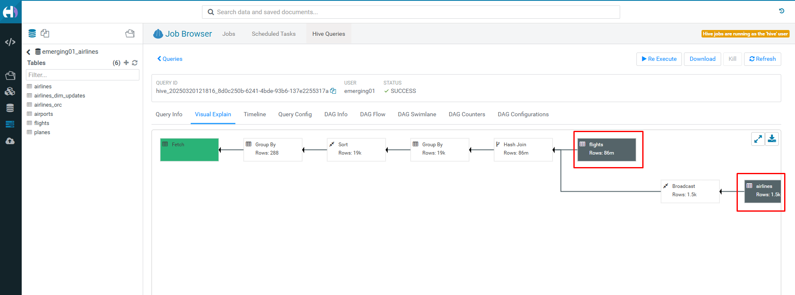 +

- Click on the `Editor` option on the left side as shown. +

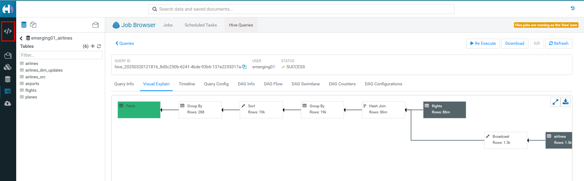 +

- *Create Materialized View (MV)* - Queries will transparently be rewritten, when possible, to use the MV instead of the base tables.  Copy/paste the following, highlight the entire block, and execute. +

[source, sql]
----

DROP MATERIALIZED VIEW IF EXISTS ${user_id}_airlines.traffic_cancel_airlines;
CREATE MATERIALIZED VIEW ${user_id}_airlines.traffic_cancel_airlines
as SELECT airlines.code AS code,  MIN(airlines.description) AS description,
          flights.month AS month,
          sum(flights.cancelled) AS cancelled,
          count(flights.diverted) AS diverted
FROM ${user_id}_airlines.flights flights JOIN ${user_id}_airlines.airlines airlines ON (flights.uniquecarrier = airlines.code)
group by airlines.code, flights.month;

-- show MV
SHOW MATERIALIZED VIEWS in ${user_id}_airlines;

----

 +

- Run Dashboard Query again to see usage of the MV - Copy/paste the following, make sure to highlight the entire block, and execute the following.  This time an `order by` was added to make this query must do more work.

[source, sql]
----

SET hive.query.results.cache.enabled=false;
SELECT airlines.code AS code,  MIN(airlines.description) AS description,
          flights.month AS month,
          sum(flights.cancelled) AS cancelled
FROM ${user_id}_airlines.flights flights , ${user_id}_airlines.airlines airlines 
WHERE flights.uniquecarrier = airlines.code
group by airlines.code, flights.month
order by airlines.code;

----

 +

- Let’s look at the Query Plan that was used to execute this query. On the left menu select `Jobs`. On the Jobs Browser - select the `Queries` tab to the right of the `Job` browser header. Hover over & click on the Query just executed (should be the first row). Click on the `Visual Explain` tab. With query rewrite the materialized view is used and the new plan just reads the MV and sorts the data vs. reading `flights (86M rows)` and `airlines (1.5K rows)` with hash join, group and sorts.  This results in significant reduction in run time for this query. +

 +

 +

== Step 6: Data Security & Governance +

In this step you will experience the combination of what the Data Warehouse and the Shared Data Experience (SDX) offers.  SDX enables you to provide Security and Governance tooling to ensure that you will be able to manage what is in the CDP Platform without having to stitch together multiple tools. Read more about SDX by clicking https://www.cloudera.com/products/sdx.html[here].

- Go to the Cloudera Data Platform Console and click on Data Catalog +

 + 

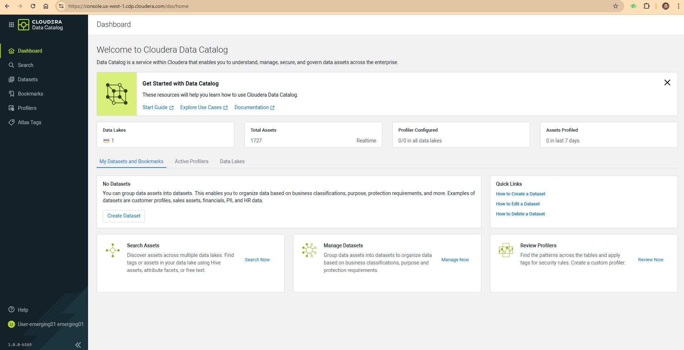 + 

- Click on the `Search` option and make sure the appropriate data lake is selected. In this case it is `emerging-aw-dl`. +

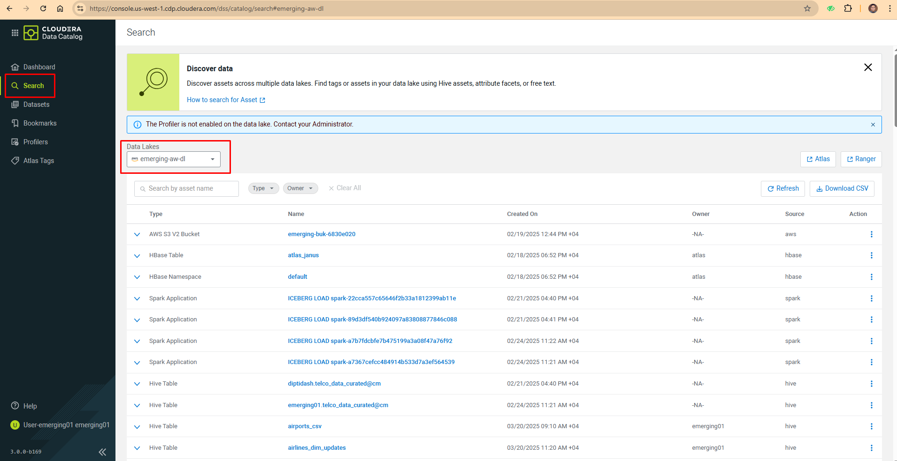 + 

- Filter for Assets we created - On the drop down filter search for `Iceberg` and select the radio button next to be `Iceberg Table`. +

 + 

- Scroll down to locate the 'flights' table and click on it. +

 + 

- This page shows information about the `flights` table such as the table owner, when the table was created, when it was last accessed, and other properties.  Below the summary details is the Overview tab which shows the lineage - hover over the flights click on the “i” icon that appears to see more detail on this table. +

 + 

The lineage shows: +
`blue box` - `flights` data file residing in an s3 folder. +
`green box`- is showing how the `flights_csv` Hive table is created, this table was created and points to the data location of `flights` `blue box` s3 folder. +
`orange box`- is showing the `flights Iceberg` table and how it is created, it uses data from flights_csv Hive table (CTAS). +
`red box` - `traffic_cancel_airlines` is a Materialized View that uses data from the flights Iceberg table. +
`grey box` - This shouldn't appear in your flow. +

- Click on the Policy tab to see what security policies have been applied on this table. Click on the arrow next to any of the `Policy Id` number as shown in the screenshot. +

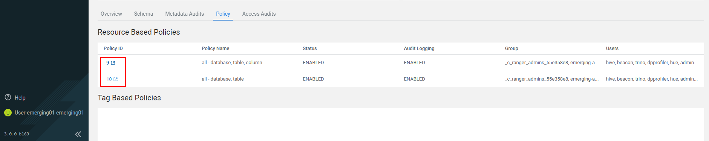 + 

- This screen shows the general Access related security policies based on the Policy Id that you clicked earlier. +

 + 

- Click on `Row Level Filter`. Currently, there are no row level filters. You will create a new one here. +

 + 

- Click on the `Add New Policy` button on top right corner. +

 + 

- Fill out the form as follows. +
`Policy Name`: <user_id>_RowLevelFilter (Ex: emerging01_RowLevelFilter) +
`Hive Database`: <user_id>_airlines (Ex: emerging01_airlines) +
`Hive Table`: flights (start typing, once you see this table in the list, select it) +
`Row Filtering Conditions`: +
    (a) `Select User`: <user_id> +
    (b) `Access Types`: select +
    (c) `Row Level Filter`:  uniquecarrier="UA" +
Click on `Save` to save the policy at the end. +

 +

 +

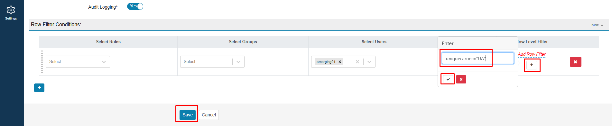 +

- The new policy is added to the `Row Level Filter` policies (as below). +

 +

- Now we shall test if the policy is working or not. Open `HUE` for the CDW Impala Virtual Warehouse - `emerging-impala-1` and execute the following query. +

[source, sql]
----

SELECT uniquecarrier, count(*)
FROM ${user_id}_airlines.flights
GROUP BY uniquecarrier;

----

- You should now only see 1 row returned for this query - after the policy was applied you will only be able to access uniquecarrier = *UA* and no other carriers.* It might take a while before it reflects.* +

 + 

== Step 7: Cloudera Data Visualization +

In this step you will build a Logistics Dashboard using Cloudera Data Visualization.  The Dashboard will include details about flight delays and cancellations. But first we will start with Data Modeling.

=== Step 7(a): Data Modeling +
- If you are not on the CDP home page, then go there and click on the following `Cloudera Data Warehouse` icon and then `Manage Data Warehouse`. +

 +

 +

- Then click on the `Data Visualization` option in the left window pane. You'll see an option `Data VIZ` next to the data-viz application with the name `emeaworkshop-dataviz`. It should open a new window. +

 +

 +

- There are 4 areas of CDV - `HOME, SQL, VISUALS, DATA` - these are the tabs at the top of the screen in the black bar to the right of the Cloudera Data Visualization banner. +

image:images/step7/7-5.png[] +

- Build a Dataset (aka. Metadata Layer or Data Model) - click on `DATA` in the top banner.  A Dataset is a Semantic Layer where you can create a business view on top of the data - data is not copied; this is just a logical layer. +

 +

- Create a connection - click on the NEW CONNECTION button on the left menu. Enter the details as shown in the screenshot and click on `TEST`.  +
    Connection type: Select `CDW Impala`. +
    Connection name: `<user_id>-airlines-lakehouse` (Ex-`emerging01-airlines-lakehouse`). +
    CDW Warehouse: `Make Sure you select the warehouse that is associated with your <user_id>`. +
    Hostname or IP address: Gets automatically selected. +
    Port: `Gets automatically filled up`. +
    Username: `Gets automatically filled up`. +
    Password: `Blank` +

 +

 +

- Click on `CONNECT`. +

 +

- You will see your connection in the list of connections on the left menu. +

 +

On the right side of the screen you will see Datasets and the Connection Explorer. Click on `NEW DATASET`. +

 +

- Fill the details as follows and click `CREATE`. `airline_logistics` gets created +
    Dataset title - `airline_logistics`. +
    Dataset Source - Select `From Table` (however, you could choose to directly enter a SQL statement instead). +
    Select Database - `<user_id>_airlines` (Make Sure you select the database that is associated with your <user_id>). +
    Select Table - `flights`.
    
 +

- Click on the Dataset - `airline_logistics` on the right of the screen. +

 +

- Click on `Data Model`. For our Dataset we need to join additional data to the flights table including the `planes`, `airlines`, and `airports` tables. +

 + 

- Click on `EDIT DATA MODEL`. +

 +

- Now we will create a join with another table `planes`. Click on the `+` icon next to the `flights` table option. +

 +

- Select the appropriate `Database Name` based on your user id (Ex: `emerging01_airlines`) and table name `planes`. +

 +

- In the `Edit Join` window delete the `[x]` against the `year` column to have only one join condition for `tailnum` and then click on `Apply`. +

image:images/step7/7-18.png[] +

- Now click on image:images/step7/joinicon.png[] to make sure `Left Join` condition is selected. +

 +

- Now we will create a join with another table `airlines`. Click on `+` icon next to `flights` as shown below. Select the appropriate `Database Name` based on your <user_id> (Ex: `emerging01_airlines`) and table name `airlines`. +

 +

 +

 +

 +

- Now we will create a join with another table `airports`. Click on `+` icon next to `flights` as shown below. Make sure you select the column `uniquecarrier` from `flights` and column `code` from the `airlines` table. Click `APPLY`. +

 +

- Click on `+` icon next to `flights` as shown below. Select the appropriate `Database Name` based on your <user_id> (Ex: `emerging01_airlines`) and table name `airports`. +

 +

- Make sure you select the column `origin` from `flights` and column `iata` from the `airports` table. Click `APPLY`. +

 +

 +

-  Now we will create another join with the table `airports`. Click on `+` icon next to `flights` as shown below. Select the appropriate `Database Name` based on your <user_id> (Ex: `emerging01_airlines`) and table name `airports`. +

 +

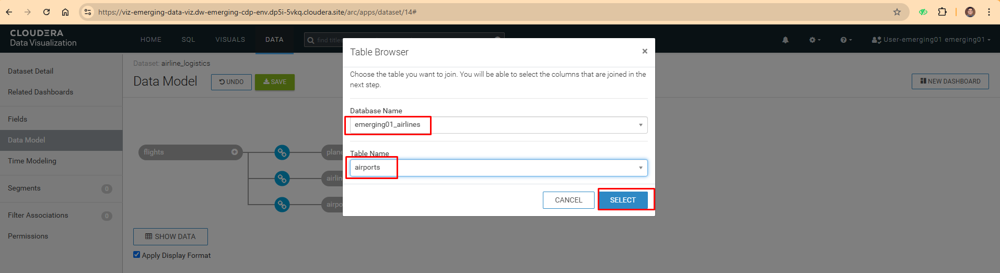 +

- Make sure you select the column `dest` from `flights` and column `iata` from the `airports` table. Click `APPLY`. +

 +

 +

- Verify that you have the joins which are as following. You can do so by clicking the image:images/step7/joinicon.png[] `join` icon. +
    `flights.tailnum` -- `planes.tailnum` +
    `flights.uniquecarrier` -- `airlines.code` +
    `flights.origin` -- `airports.iata` +
    `flights.dest` -- `airports_1.iata` +

- Click on `SHOW DATA`. And then click on `SAVE`. +

 +

 +

image:images/step7/7-34.png[] +

- Click on the `Fields` column on the left window pane. Then click on `EDIT FIELDS`. Make sure that you click on the highlighted area to change `#` (measures icon) next to each column to `Dim` (dimension icon). The columns are as follows. +
a. `flights` table: Columns (`month`, `dayofmonth`, `dayofweek`, `deptime`, `crsdeptime`, `arrtime`, `crsarrtime`, `flightnum` & `year`) +
b. `planes` table: `All columns` +
c. `airports` table: `All columns` +
d. `airports_1` table: `All columns` +

 +

 +

 +

- Click on `Edit Fields` & then Click on `TITLE CASE`. And notice that the column names changes to be `Camel case`. Click on the `pencil` icon next to the `Depdelay` icon. +

 +

image:images/step7/7-39.png[] +

- Change the `Default Aggregation` to `Average`. Click on the `Display Format` and then change `Category` to be `Integer`. Check mark the box next to the `Use 1000 separator`. Click on `APPLY`. +

 +

 +

- Click on the `down arrow` shown against the `Origin` column and then click on `Clone`. A column `Copy of Origin` is created. Click on the 'pencil' icon next to it. +

 +

 +

- Change the `Display Name` to `Route`. Then click on `Expression` and enter the following in the `Expression` editor.  Click on `APPLY`. +

[source, sql]
----

concat([Origin], '-', [Dest])

----

 +

 +

- Click on `SAVE`. We have completed the step of data modeling and now we will create data visualization. +

image:images/step7/7-47.png[] +

 +

=== Step 7(b): Creating Dashboard +

- Now we will create a dashboard page based on the data model that we just created. Click on `NEW DASHBOARD`. +

 +

- You will see the following. +

 +

- A quick overview of the screen that you are seeing is as follows. On the right side of the screen there will be a VISUALS menu.  At the top of this menu, there is a series of Visual Types to choose from.  There will be 30+ various visuals to choose from.  Below the Visual Types you will see what are called Shelves.  The Shelves that are present depend on the Visual Type that is selected.  Shelves with a `*` are required, all other Shelves are optional.  On the far right of the page there is a DATA menu, which identifies the Connection & Dataset used for this visual.  Underneath that is the Fields from the Dataset broken down by Dimensions and Measures.  With each of these Categories you can see that it is subdivided by each Table in the Dataset. +

 +

- Let's build the 1st visual - `Top 25 Routes by Avg Departure Delay`. CDV will add a Table visual displaying a sample of the data from the Dataset as the default visualization when you create a new Dashboard or new Visuals on the Dashboard (see New Dashboard screen above).  The next step is to modify (Edit) the default visualization to suit your needs.   +

- Pick the Visual Type - Select the `Stacked Bar` chart visual on the top right as shown below. Make sure `Build` is selected for it to appear on the right side. +

image:images/step7/7-52.png[] +

- Find `Route` under `Dimensions -> flights`. Drag to `X-Axis`. Similarly, find `DepDelay` under `Measures -> flights`. Drag to `Y-Axis`. By default the aggregation selected is average and hence you would see `avg(Depdelay)`. +

 +

-  Click on the arrow next to `avg(Depdelay)`. Enter `25` against the text box labeled `Top K`. Click on `REFRESH VISUAL`. +

 +

- Click `enter title` and enter the title based on your user id as - `<user_id>- Routes with Highest Avg. Departure Delays`. Then click on `SAVE`. +

 +

 +

=== Cloudera Partners
(1). https://github.com/cloudera-labs/cdp-validation?tab=readme-ov-file#register-on-cloudera-sso[Register on Cloudera SSO] + 
(2). https://github.com/cloudera-labs/cdp-validation?tab=readme-ov-file#register-on-cloudera-partner-portal[Register on Cloudera Partner Portal] +
(3). https://github.com/cloudera-labs/cdp-validation#request-for-development-license[Request for developer License] +

== &#x25B6; Recording
The entire lab is recorded and you can watch the same to have a better understanding of the lab. +
https://www.youtube.com/watch?v=2pvxWb2vvGo[CDW Workshop (Recording)]

 +
